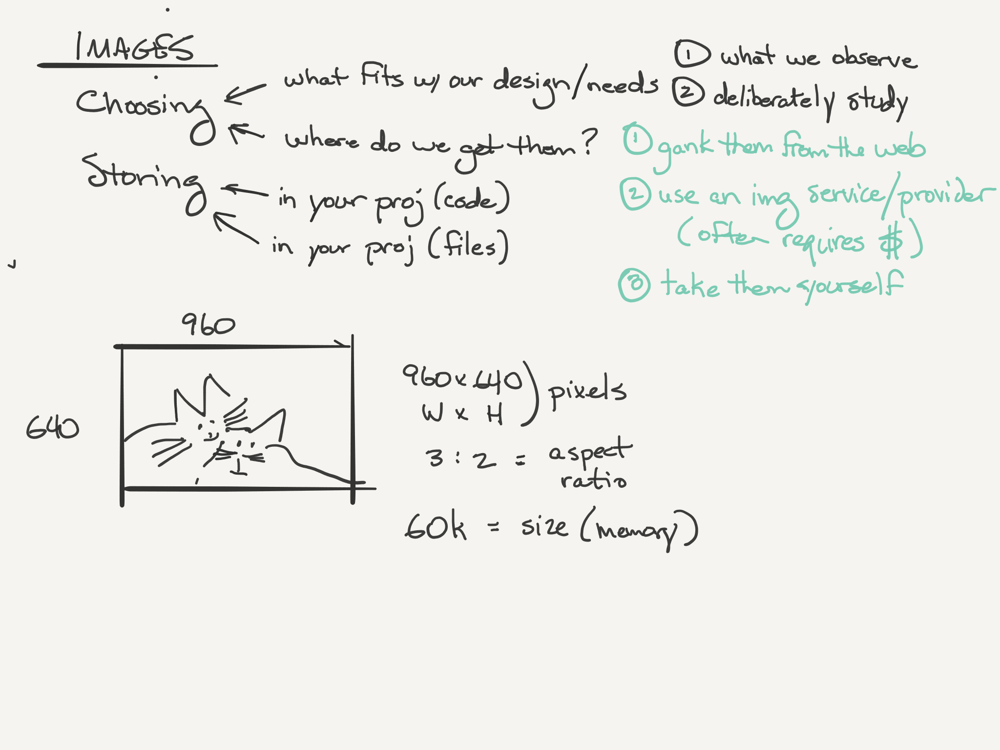
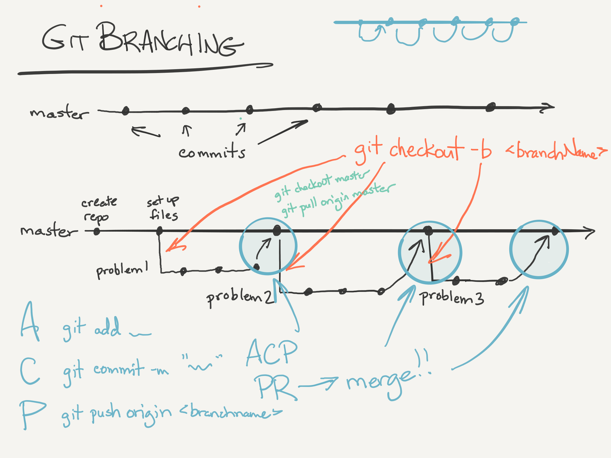
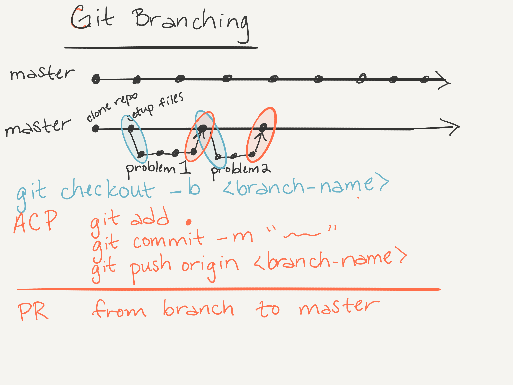
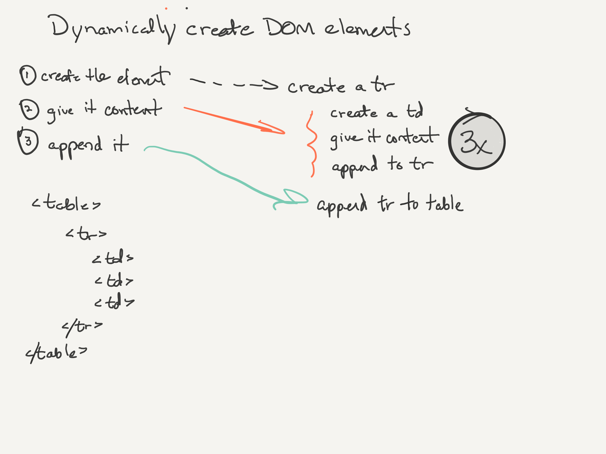

# Class 5: Understanding Images, plus CSS for Color & Text Styling

### Overview
In Week 1, as in the other weeks, the last class is a mop-up day. It’s a time to make sure that all little problems of the week have been addressed, focus on clarification and command of material from the week, and put a nice clear wrapper on the week as a whole. This will allow students to go into the transition to Week 2 feeling like there is a cohesive body of material that has been covered during the week, and looking forward to a similar experience the following week.

Management of student psychology is key to success in this course, and this is an important day for that. This is the time to dial in that ideal blend of humility and confidence that feeds a growth mindset. It’s good to take a look back at their Class 1 lab assignment to show them how far they have come, or maybe to take a peek into the pre-work and show how easy that looks now. It wasn’t easy for the students a week ago.

At this point in the course, begin holding one-on-one meetings with students. The easiest way to handle this is to ask students to sign up for a 15-minute time slot using a tool like [youcanbook.me](https://youcanbook.me/). Use this time to allow students to talk about how the class is going so far, ask questions, and express any concerns. Students might also ask about the 301 and 401 courses.

The key technical piece today is to get their first GitHub Pages deployment active so that they can share their work with each other (and with their family and friends if they choose). It’s also fun to have them pull up their deployed page on their mobile devices to see how it looks there. It all makes this process more tangible and meaningful for the students when they see how their work all cooks down into a URL.

The lab for today is a “one-off” --- not connected to the rest of the week --- that gives the students more practice with pair programming and also with functions to do mathematical calculations that accept and return values in a variety of structures. The functions are a setup for the methods they will be writing in the next project.

This should be posted to the class Slack channel on this day: https://medium.freecodecamp.com/things-i-wish-someone-had-told-me-when-i-was-learning-how-to-code-565fc9dcb329#.ih137zeoo

[-top-](#top)

### Class 5 Lecture: Understanding Images, plus CSS for Color & Text Styling
* Code Review
  * Follow up with students about their experience with pair-programming from the previous day. Encourage students to share what they learned and the benefits of pair-programming.
  * Rather than a line-by-line code review, pull up an example submission and point out the benefit of refactoring into functions. Make a point of discussing anything that was above and beyond the assignment, such as the use of arrays for the stretch goals or using a solution that new programmers would not have encountered yet. For example, if there is a student who has programming experience, they might be tempted to use an object or come up with a unique scoring system. Keep the explanation of these types of topics brief: it is important to encourage students' curiosity without going down any rabbit holes or confusing students whose confidence is wavering.
* HTML/CSS book, Ch. 5, “Images”  
  * p.97: Choosing and storing images  
  * p.99: `` tag with 'height' and 'width' attributes  
		* Explain difference between the `alt` text and `title` text
    * Point out that this is a self-closing tag
  * p.101: Image alignment in text  
  * p.107: 3 rules for creating images  
  * p.109: Image formats (JPG, GIF, PNG)  
		* Explain the differences between the file formats and when each one is the best choice
  * Other topics: dimensions, cropping, resolution, vector, animation, transparency, inspecting on web  
* HTML/CSS book, Ch. 11, “Color”  
  * p.249: Foreground color  
  * p.250: Background color  
  * pp.251-52: Understanding color (excellent overview)  
  * p.253: Contrast  
  * p.254: Opacity  
  * p.255: HSL colors  
* HTML/CSS book, Ch. 12, “Text”  
  * p.267: Typeface terminology  
    * Serif  
      * Serif fonts have extra details on the ends of the main strokes of the letters. These details are known as serifs.
    * Sans-Serif  
      * Sans-serif fonts have straight ends to letters, and therefore have a much cleaner design.  
    * monoSpace  
      * Monospace fonts are commonly used for code because they align nicely, making the text easier to follow.  
  * p.269: Choosing a Typeface  
  * p.271: Techniques that offer a wider choice of typefaces  
  * pp.275-76: Type scales and sizes  
  * pp.279 and on: text transformations such as bold, italic, upper/lower, underline, strike, leading, spacing, alignment, indenting, drop shadow, first letter  
  * p.292: Attribute selectors
* Additional topics to wrap up the week
* Git Branching and Deployment
* Code Demo

[-top-](#top)

### A smattering of topics

A few things to cover if they have not already been addressed this week:
* 'use strict'
* W3 Schools vs. MDN vs Stack Overflow, etc.
* Linter setups
* The increment operator
* Logical operators % short circuiting
* String methods
* Array methods
* Function declarations vs. function assignments
* CSS Zen Garden
* GIMP
* Unsplash

### Git branching and Deployment

Branching:
* Concepts of labeling and workflow  
* New terminal commands:
	* `git checkout -b <branch-name>`
    * always checkout new branches from `master`
	* `git checkout <branch-name>`
	* `git push origin <branch-name>`
	* `git pull origin master`
    * always keep local master branch current with master branch on GitHub
	* `git branch`  
* Pushing different branches  
* Isolating changes  
* Remind students of proper workflow and emphasize the importance of performing all of the steps in the correct order. They will confused at first, so encourage students to make a cheat sheet and be very mindful of when and why each command is used
* It can be helpful to show a network graph in GitHub as an illustration of proper branching and workflow

Deployment:
* Show students how to navigate in GitHub to Settings, then scroll down to find the url of their deployed page
	* The deployed site takes the format of: `https://<username>.github.io/<repo-name>/`

[-top-](#top)

### Class 5 Lab: Write Some Function on Git Branches

Today's lab is a 'one-off' lab, in that it is not directly connected to the weekly About Me project.

However, also remind students that their second lab assignment is to finish their About Me project. It should be fully function with styling added. These are two separate code assignments in Canvas.

Each student will be working on a separate branch for each problem. Work through the first problem together, creating a branch named `problem1`. Walk through the process of forking and cloning the repository, checking out a new branch, solving the problem, pushing to GitHub, making a pull request from `problem1` to `master`. Make sure to point out that their pull request should be between branches within THEIR OWN forked repository, and NOT from their repository to the Code Fellows repository. Then switch back to master and demonstrate the purpose of the `git pull origin master` command.

During the lab demonstration, emphasize the importance of reading the directions for the expected return values and paying attention to detail. Complete the first problem, but incompletely, so the test fails at first, then fix the solution so it passes. For example, forget something when concatenating the message. Demonstrate how to check if the tests are passing in the browser console.

Students typically find that their tests are failing because they made a small mistake in their concatenation. A common sticking point for this lab is accessing the result from the returned array. For example, it will probably not be intuitive to students to access the result by way of `sum(a,b)[0]`. The instructional staff should be prepared to spend time explaining this logic to students during lab time. This is a good opportunity to add `console.log()` messages as part of the debugging process.

[-top-](#top)

## Whiteboard Diagrams

### Images

---

### Git Branching

---

### Git Branching 2

---

### Dynamic creation of DOM elements

---

[-top-](#top)